# MHALE TOOL

  

  <b>Bộ công cụ tiện ích đa năng dành cho Windows 10 & Windows 11</b> 
  Tối ưu hệ thống • Sao lưu dữ liệu • Cài đặt phần mềm • Sửa lỗi máy in • Quản lý BitLocker

  
  
  

---

## Giới thiệu

**MHALE TOOL** là bộ công cụ tích hợp nhiều tiện ích hữu ích giúp người dùng Việt Nam dễ dàng:

- Theo dõi thông tin phần cứng theo thời gian thực
- Tối ưu và thiết lập Windows nhanh chóng
- Cài đặt Microsoft Office chính hãng
- Sao lưu WiFi, Driver, dữ liệu cá nhân
- Sửa lỗi máy in & mạng LAN
- Quản lý BitLocker an toàn
- Cài đặt Microsoft Store cho Windows LTSC
- Kho driver Intel RST / VMD
- Gỡ bỏ bloatware & phần mềm rác

Giao diện hiện đại, tiếng Việt 100%, hỗ trợ tray icon.

---

## Tính năng chính

### Hệ thống
| Tính năng | Mô tả |
|---------|------|
| **Thông tin máy tính** | Giám sát CPU, RAM, GPU, Ổ cứng, Pin real-time. Xuất Excel / CSV |
| **Thiết lập Windows** | Tối ưu File Explorer, Power Plan, đồng bộ thời gian NTP, chuẩn hóa ngày giờ Việt Nam |
| **Thiết lập Office** | Cấu hình chuẩn công văn (NĐ 30), font, căn lề, Normal.dotm |
| **Quản lý BitLocker** | Bật / tắt, khóa / mở khóa, tạm dừng bảo vệ, xuất Recovery Key 48 số |

### Sao lưu - Khôi phục
- **Sao lưu WiFi**: Lưu mật khẩu và cấu hình mạng đã kết nối
- **Sao lưu Driver**: Sao lưu toàn bộ DriverStore + OEM
- **Sao lưu Dữ liệu**: Desktop, Documents, Downloads, Pictures, Videos, Fonts, trình duyệt...

### Cài đặt
- **Kho ứng dụng**: Cài tự động Chrome, Cốc Cốc, 7-Zip, WinRAR, .NET, VLC, Notepad++, TeamViewer...
- **Cài đặt Office**: Hỗ trợ Office 2016 → 2025 / Microsoft 365 (64-bit & 32-bit)
- **Kho ISO**: Windows 10/11 (Consumer + LTSC), Ubuntu Desktop & Server + Autounattend
- **Thiết lập máy in**: Sửa lỗi Spooler, chia sẻ máy in, các lỗi 0x phổ biến

### Tiện ích khác
- **Zalo Tool**: Chạy nhiều tài khoản Zalo trên cùng máy
- **Xóa / Gỡ phần mềm rác**: Gỡ bloatware Windows, 360, AVG, BKAV, McAfee, WPS...
- **Store cho Win LTSC**: Cài Microsoft Store + Xbox cho Windows 10/11 LTSC
- **Kho Driver IRST**: Driver Intel RST / VMD từ v15.x → v20.x (WHQL)

---

## Giao diện

| Module | Screenshot |
|--------|----------|
| Thông tin máy tính | 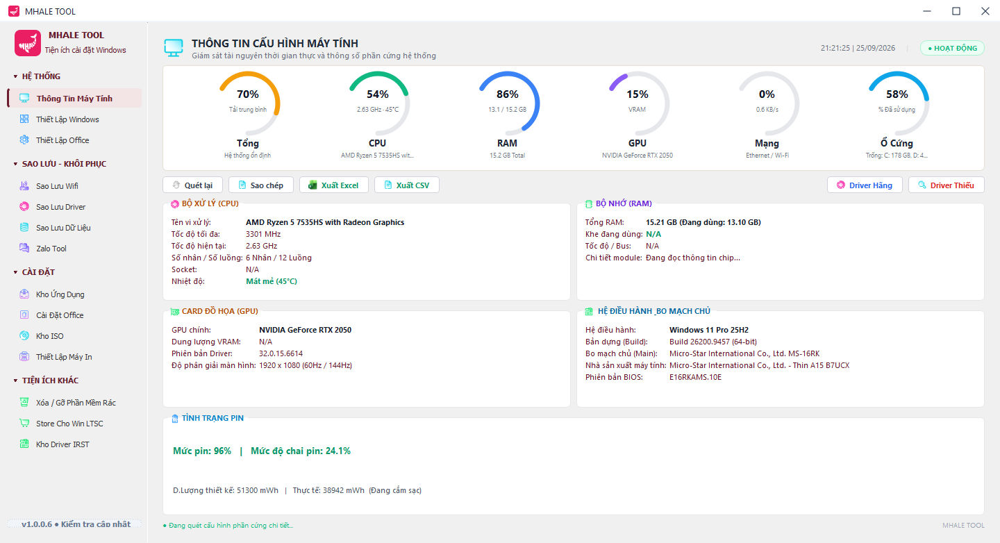 |
| Thiết lập Windows | 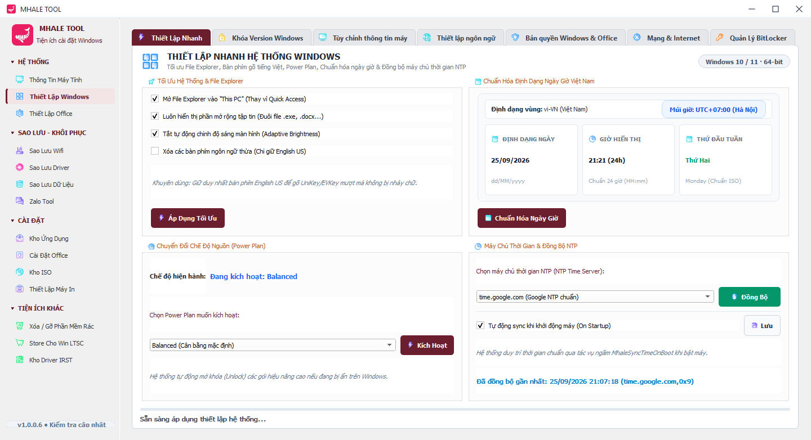 |
| Thiết lập Office | 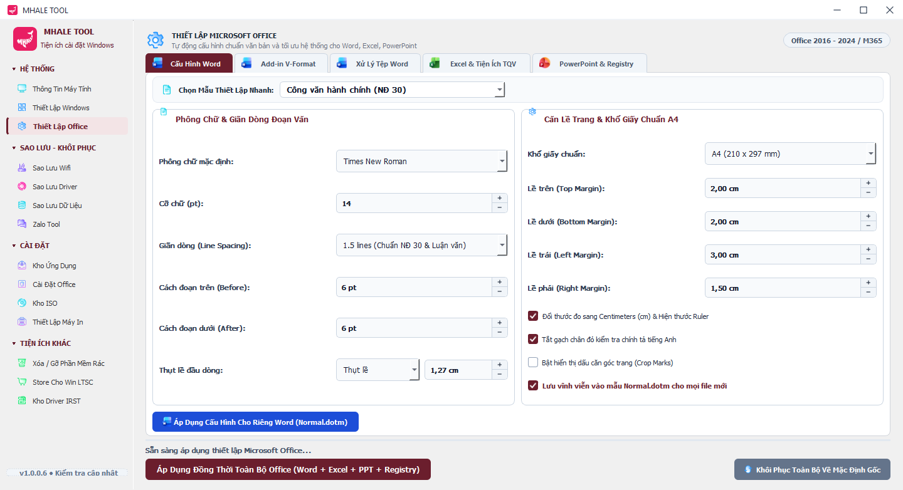 |
| Sao lưu WiFi | 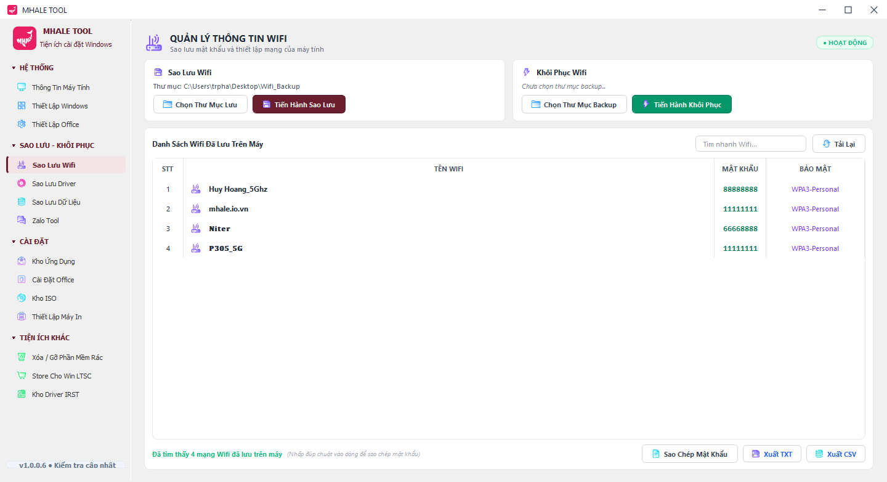 |
| Sao lưu Driver | 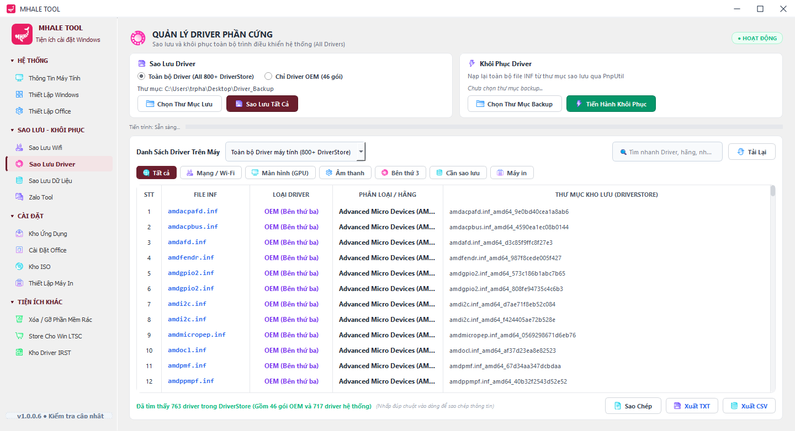 |
| Sao lưu Dữ liệu | 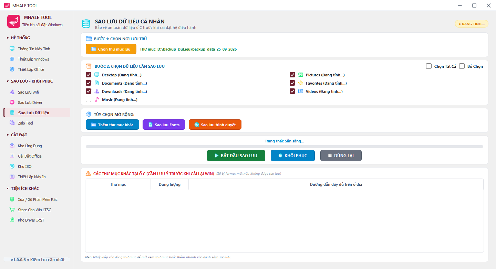 |
| Zalo Tool | 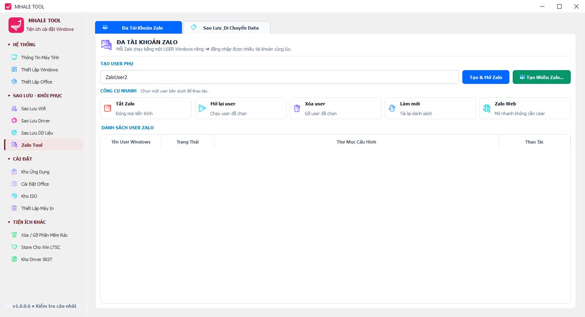 |
| Kho ứng dụng | 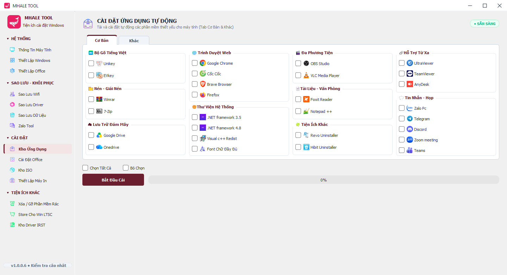 |
| Cài đặt Office | 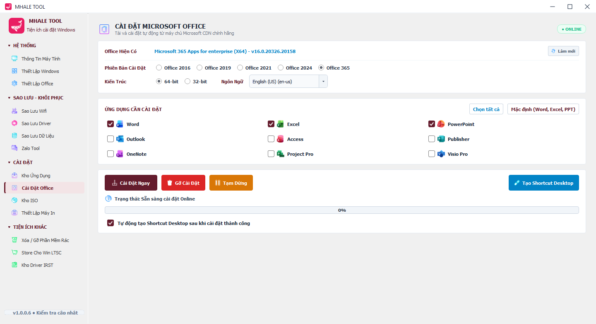 |
| Kho ISO | 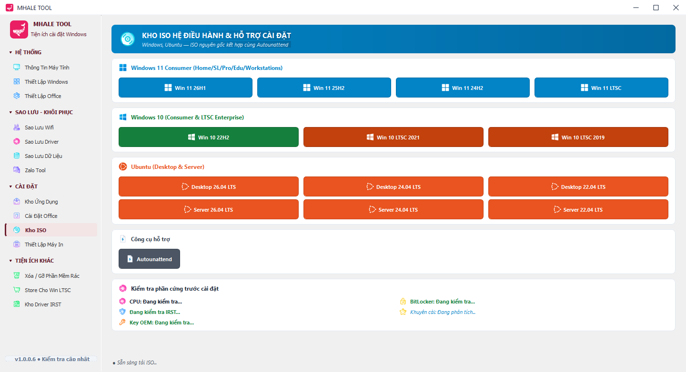 |
| Thiết lập máy in | 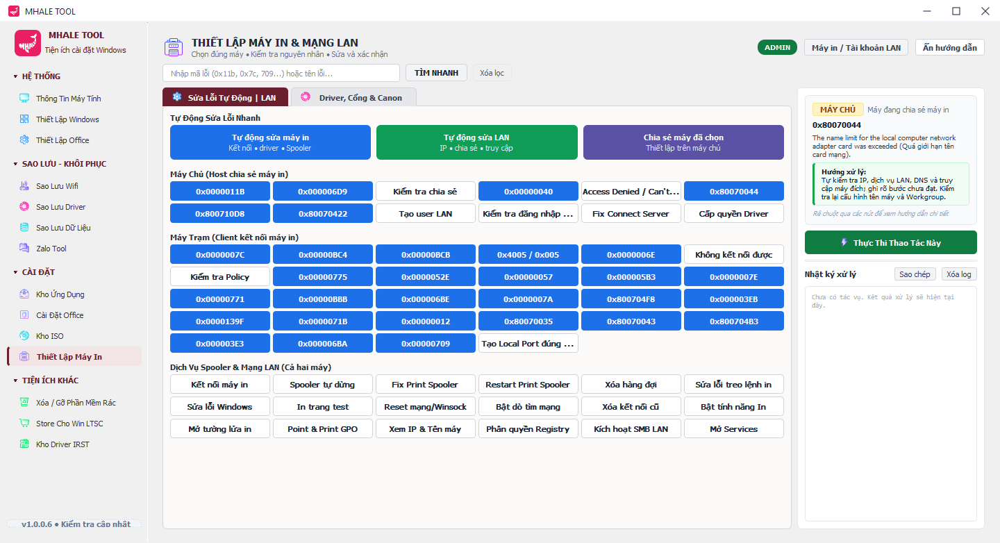 |
| Xóa / Gỡ phần mềm rác | 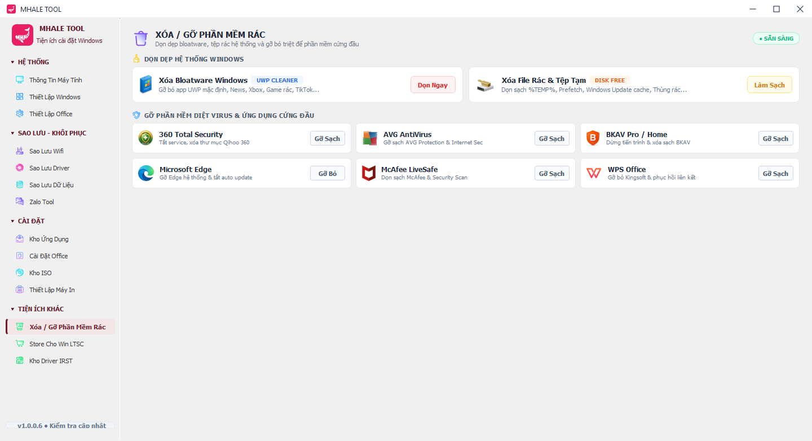 |
| Store cho Win LTSC | 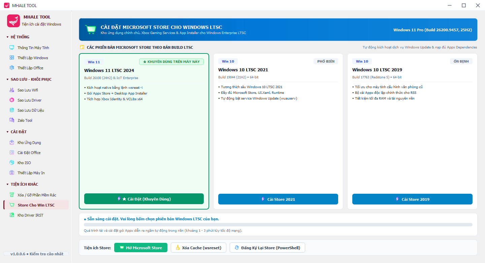 |
| Kho Driver IRST | 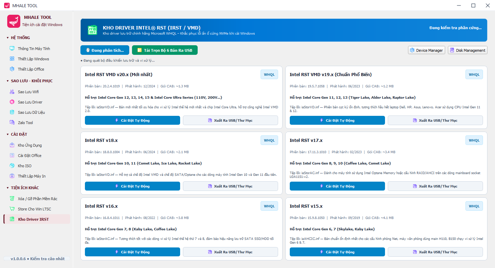 |
| Tray Menu | 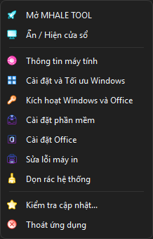 |
| Quản lý BitLocker | 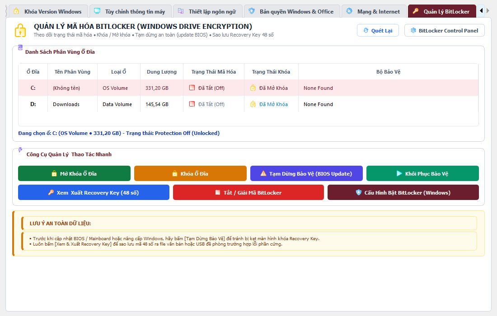 |

---

## Yêu cầu hệ thống

- Windows 10 hoặc Windows 11 (64-bit khuyến nghị)
- Quyền Administrator (một số chức năng cần)

---

## Tải về & Sử dụng

1. Truy cập trang **[Releases](https://github.com/PhTrien/mhale_tool/releases)**
2. Tải bản phát hành mới nhất
3. Giải nén và chạy file `MHALE TOOL.exe`
4. Cho phép quyền Administrator khi được hỏi

---

## Lưu ý quan trọng

- **Luôn sao lưu Recovery Key** trước khi thao tác với BitLocker hoặc cập nhật BIOS / Mainboard.
- Một số chức năng (Driver, BitLocker, Office, sửa máy in) yêu cầu chạy với quyền **Administrator**.
- Tool không thu thập bất kỳ dữ liệu nào của người dùng.

---

## Giấy phép

Dự án được phát hành dưới giấy phép **BSL-1.0**.

Xem chi tiết tại file [LICENSE](LICENSE).

---

## Tác giả

**PhTrien**  
GitHub: [https://github.com/PhTrien](https://github.com/PhTrien)

---

  Made with ❤️ in Vietnam

